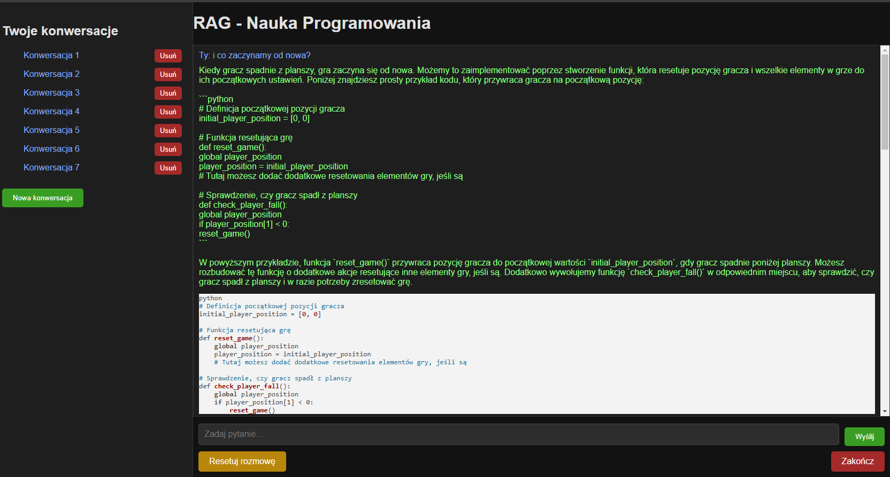

# RAG - Learning Programming: Frogger Game
___
### Screenshot:

___
## Project Description
This project is an implementation of a RAG (Retrieval-Augmented Generation) system that helps users, especially beginner programmers, learn programming by creating the game Frogger in Python. The system is based on knowledge extracted from a PDF file describing the process of creating the Frogger game and supports users in a simple, accessible way.

The user interface provides a friendly way to interact via a web application with features including:

* Asking questions about Frogger and programming.
* Displaying suggested code snippets in response to questions.
* Resetting the conversation and closing the application.

___

## Technologies
The project uses the following technologies:

~~~~
    Python: The main programming language.
    Flask: A lightweight library for building web applications.
    OpenAI GPT-3.5: The model generating answers to user queries.
    FAISS: For retrieving relevant text fragments from the knowledge base.
    SentenceTransformers: For generating text embeddings.
    PyPDF2: For extracting text from a PDF file.
    HTML/CSS/JavaScript: For building the user interface.
~~~~
___
## Features
* Programming Learning Support: The system answers questions related to creating the Frogger game in Python.
* Code Display: The system generates code snippets as suggestions for the user.
* Web Interface: Enables asking questions, resetting the conversation, and closing the application.
* Personalized Responses: The GPT model responds in simple English, tailored to beginners.
___
## Requirements

Before running the project, ensure you have:

* Python 3.8+

Install the required libraries:

~~~~
pip install -r requirements.txt
~~~~
___
### requirements.txt File
##### The list of libraries used in the project:

~~~~
flask
openai
tiktoken
sentence-transformers
faiss-cpu
PyPDF2
python-dotenv
~~~~
___
## Preparing the PDF File
The application requires a PDF file containing the knowledge used to generate answers.

* Place the "Code the Classics Volume 1" PDF file, published by Raspberry Pi Press, in the Docs/ directory.
* This file describes the process of creating the Frogger game and other classic games.
* Ensure the file is saved under the path: Docs/Code_the_Classics-book.pdf.
___
## Running the Project

### 1.  Configure the OpenAI API Key:

* Create a .env file in the root directory.
* Add your API key to the file:
  ~~~~
    OPENAI_API_KEY=your-api-key
  ~~~~

### 2. Run the Application: In the terminal, type:
~~~~
  python app.py
~~~~
  After starting the application, open your browser and go to:

~~~~
http://127.0.0.1:5000
~~~~

### 3. Using the Application:

* Enter your question in the input field and click "Send".
* You will receive an answer and code snippets that you can use.
* You can reset the conversation using the "Reset Conversation" button or close the application using the "Exit" button.
___

### Project Structure:
~~~~
project/
├── app.py               # Web application (Flask)
├── main.py              # Console interface
├── rag_engine.py        # RAG logic and data processing
├── pdf_processor.py     # PDF file handling
├── conversation.json    # JSON file with saved conversations
├── templates/           # HTML for the user interface
│   └── index.html
├── static/              # CSS for the user interface
│   └── styles.css
├── Docs/                # PDF files
│   └── Code_the_Classics-book.pdf
└── .env                 # API key file (added by the user)
~~~~
___
### Example Questions
* How do I create the frog in Frogger?
* How can I add obstacles in Frogger?
* What is the main game loop?

### Project Development
Potential extensions:

1. Adding support for multiple languages.
2. Integrating with a database to store conversation history.
3. Deploying the application to a cloud platform like Heroku.

